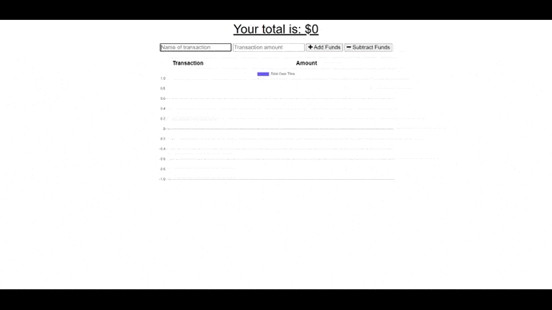
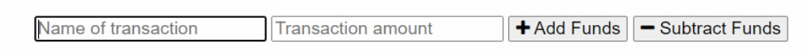
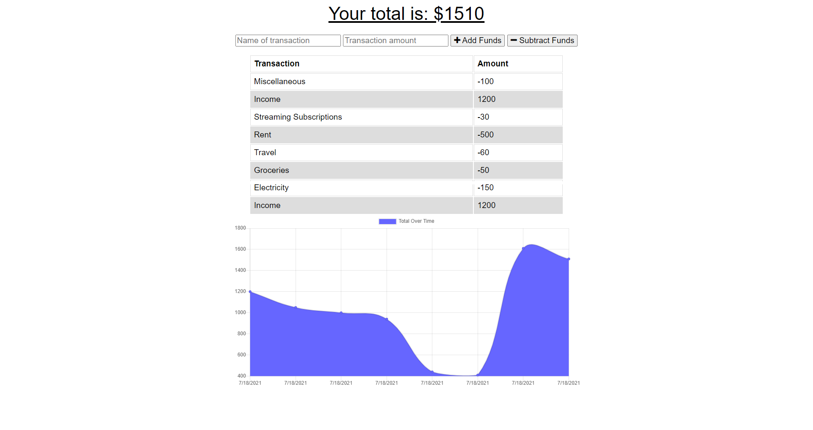

# Budget Tracker (PWA)

[](https://opensource.org/licenses/MIT)
[](https://opensource.org/licenses/MIT)
[](https://nodejs.org/en/docs/)
[](https://expressjs.com/)
[](https://www.mongodb.com/)
[](https://mongoosejs.com/)
[](https://www.javascript.com/)
[](https://developer.mozilla.org/en-US/docs/Glossary/HTML5)
[](https://developer.mozilla.org/en-US/docs/Web/CSS)
[](https://developer.mozilla.org/en-US/docs/Web/CSS)

## Description

An application that allows a user to add expenses and deposits to their budget with or without a connection. When entering transactions offline, it will populate the total when back online

The application uses the Mongo database with a Mongoose schema and handles routes with Express. IndexedDB is used to cache the data on in local storage when offline.

## 📖Table of Contents
1. [Installation](#installation)
2. [Usage](#usage)
3. [Assets](#assets)
4. [Technologies](#Technologies)
5. [License](#license)
6. [Contributing](#contributing)
7. [Tests](#tests)
8. [Questions](#questions)

## Installation
To install this application select the menu button in the browser (vertical three dots button in the top right for Google Chrome) and select ```Install Budget Tracker Plus```. 
    
## Usage
Enter a deposit or expense transaction via the input fields and the add and subtract buttons. 

## Assets
Live demo of the application hosted on Heroku: [Budget Tracker PWA](https://budget-tracker-pwa-plus.herokuapp.com/)

The following images shows the functionality of the application: 







## Technologies
- [Node.js](https://nodejs.org/en/docs/)
- [Express](https://expressjs.com/)
- [MongoDB](https://www.mongodb.com/)
- [Mongoose](https://mongoosejs.com/)
- [Nodemon](https://www.npmjs.com/package/nodemon)
- [Morgan](https://www.npmjs.com/package/morgan)
- [Heroku](https://www.heroku.com/)
- [IndexedDB](https://developer.mozilla.org/en-US/docs/Web/API/IndexedDB_API)
- [Manifest](https://developer.mozilla.org/en-US/docs/Mozilla/Add-ons/WebExtensions/manifest.json)
- [Service Worker API](https://developer.mozilla.org/en-US/docs/Web/API/Service_Worker_API)
- JavaScript

## License
Copyright © 2021 [Trushil](https://github.com/TrushilBudhia)

This project is [MIT](./LICENSE) licensed

## Contributing
Contributions, issues and feature requests are welcome.

Feel free to check the [issues page](https://github.com/TrushilBudhia/Budget-Tracker-PWA/issues) if you want to contribute.

## Tests
There are no tests currently for this application.

## Questions
For any questions, please contact the author:

- Github: [@Trushil](https://github.com/TrushilBudhia)
- Email: trushil.budhia@gmail.com


